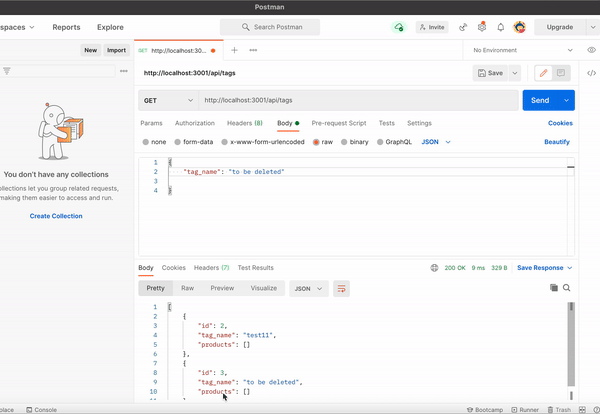

# E-Commerce-Back-End
This app serves as the back-end for an E-Commerce Website. Express.js was used for the server side and MYSQL for the database. Sequelize was used for the ORM to run SQL models.

# Technologies used
- Express.js
- Node.js
- MYSQL
- Sequelize
- Dotenv

# Deployed links:
https://github.com/rayaalsaedi/E-Commerce-Bank-End

# Demo:
Click on the image below to play the video.

(https://drive.google.com/file/d/1ElRatTSRDReIsxrHvVl6DZjHzaVBdRw5/view?usp=sharing)
